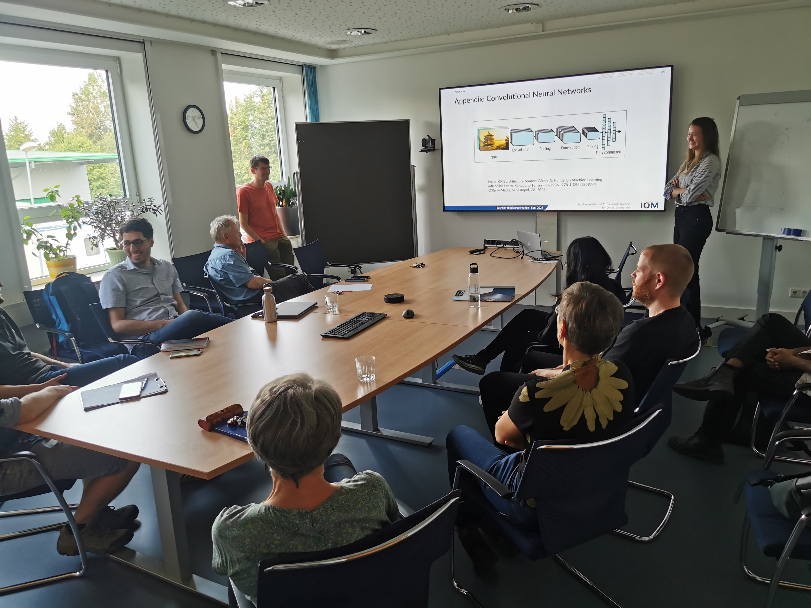

You can check out <a href="\files\Thesis_Natasha_Hrycan.pdf" target="_blank">my bachelor thesis here</a>.

I needed to wait until my presentation was done for sharing my thesis work with all of you. I worked at the Leibniz Institute for Surface Engineering (IOM) in the Department of Modelling and Simulation, under the supervision of Prof. Dr. André Anders and Dr. Stefan Zahn. I worked on the implementation on Machine Learning for Object Detection in experimental physics, specifically in this case for detecting defects in ceramic coating films (<a href="https://doi.org/10.3389/fmats.2020.00200" target="_blank">here</a> is a more detailed paper on the films I was using).

Needless to say, I really enjoyed this experience! I found the suggestion for the thesis topic at the institute's website and I contacted Dr. Zahn, asking if we could have a meeting. In the meeting we discussed the following: what were the goals of the work, what experience do I need and in what fields, what literature could I study to prepare myself in case of lack of experience, and how long would this work take. Everything fit well with my expectations and schedule, so I went ahead later and confirmed that we could start our work at the beginning of my last semester. 

For those that will soon start their bachelor thesis and are looking for topics, search for institutes that have departments that interest you and just send an email if you can't find info about what bachelor thesis topics they can offer. Most likely you will get a positive response, and in case they don't have space for another student in their research group, you can always ask them for suggestions of where to search!

One of the most interesting libraries I worked with during this thesis is <a href="https://github.com/obss/sahi" target="_blank">SAHI</a>, this can be an amazing tool if you're working with images that contain small and tiny objects. Even though I worked with Tensorflow, I wouldn't necessarily suggest others doing the same, you will encounter tons of deprecations and problems with libraries, plus most videos you'll find are not that recent. Towards the end of my work, two Computer Science students suggested me to use Pytorch instead. Unfortunately, it was a bit too late for me to change all of the work I have done, but that's why I'm passing on the advice to you, dear reader, try Pytorch instead of Tensorflow.

I was really invested in this work so the presentation was fairly easy for me. The difficult part was to cut on the less important topics so I wouldn't pass my 25 min limit. Besides some friends (ily guys) and my supervisors, people from other departments also attended the presentation, which resulted in an amazing debate of how this could be applied in other areas and how to improve the methods I tried. That's the beauty of science, debate towards development and teach each other whatever we already know, as well as being always open to receive suggestions to improve your work!

After that we celebrated with some fudgie chocolate cake and ice cream, and now I'll just be waiting for my grade and my diploma to arrive by post! XD

If you're interested, you can check out my presentation <a href="\files\presentation_thesis.pdf" target="_blank">here</a>.