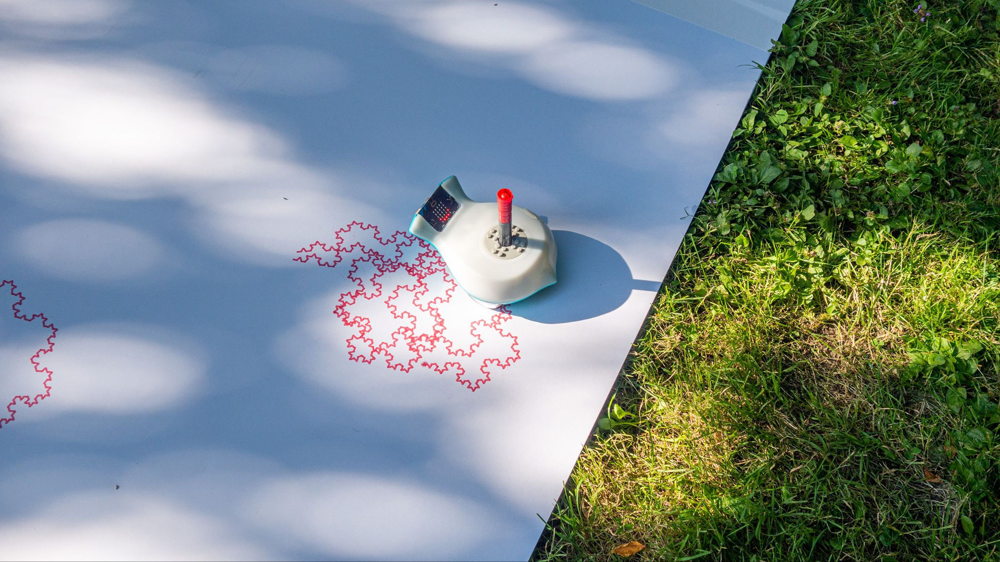
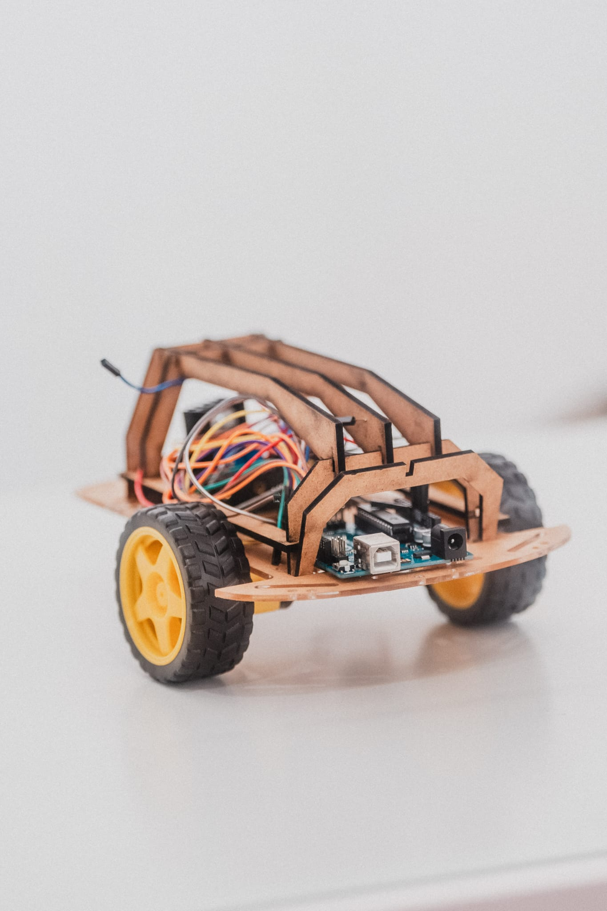
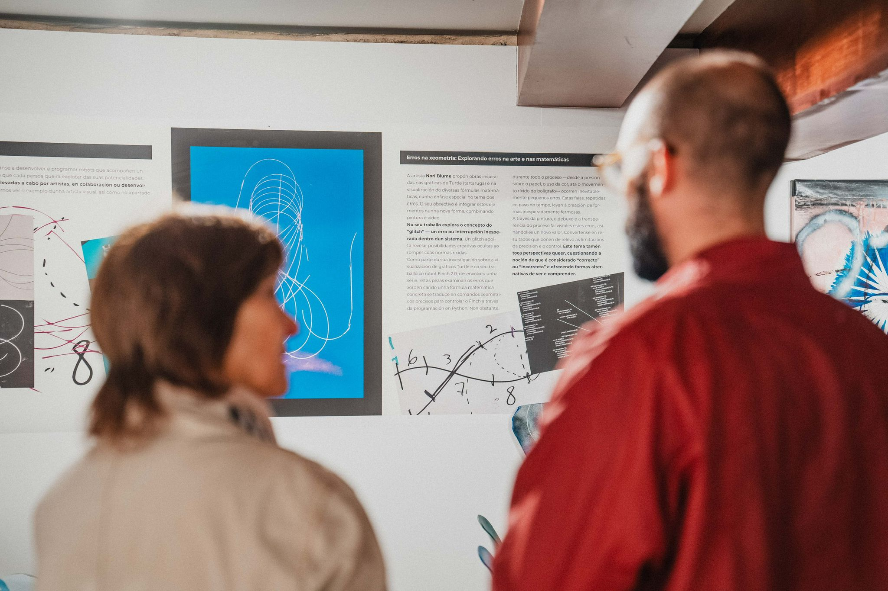

One of the main projects in which I've been working on in the last months at ScaDS.AI and MPI MIS is an educational robot. The idea was to create projects and spaces where we can combine all elements of STEAM (Science, Technology, Engineering, Arts and Mathematics), mainly focusing on the two latter ones.

We started working with the <a href="https://www.birdbraintechnologies.com/products/finch-robot-2-0/">Finch robot</a> (see above image) as a tool to teach programming and it was used in workshops with school students and artists.

This robot was a good interactive way for beginner programmers to see the results of their program, encouraging an atmosphere of trial and error, which I consider is fundamental when learning how to program. This robot allows users to attach markers so it can paint on surfaces, and it includes sensors and lights to play with. Even though it was a nice tool, our group considered it could get better in the following points: a unified environment for programming and improve the customization of the robot. 
<!--If you're interested in reading in more detail about our experience, you can look at these papers we wrote about it -->

Based on our experiences we went ahead and started working on designing a robot that solves the flaws that we had in previous workshops. Our proposal focuses on:
- Creating a multidisciplinary environment for high school students with different interests to engage together, promoting collaboration as in real-world working environments.
- Introducing basic notions about ML&AI, modernizing the educational program and building a bridge that prepares high school students to enter university with a basic knowledge of these technologies, so that they can start working on applications in their respective fields.

So, what's our idea? An educational robot that implements a TinyML module, customizable (to certain extent) with a comprehensible suite to learn the basics of programming. On top of this, we plan on developing an educational program that compliments this tool for teaching, so educators can implement the new concepts in their classrooms with a proper guide. 

Recently our robot took part of an exposition in Spain, <a href="https://desfoga.eu/">DESFOGA</a>. In the image you can see part of the presentation of artists that work in our group with the Finch robot.
